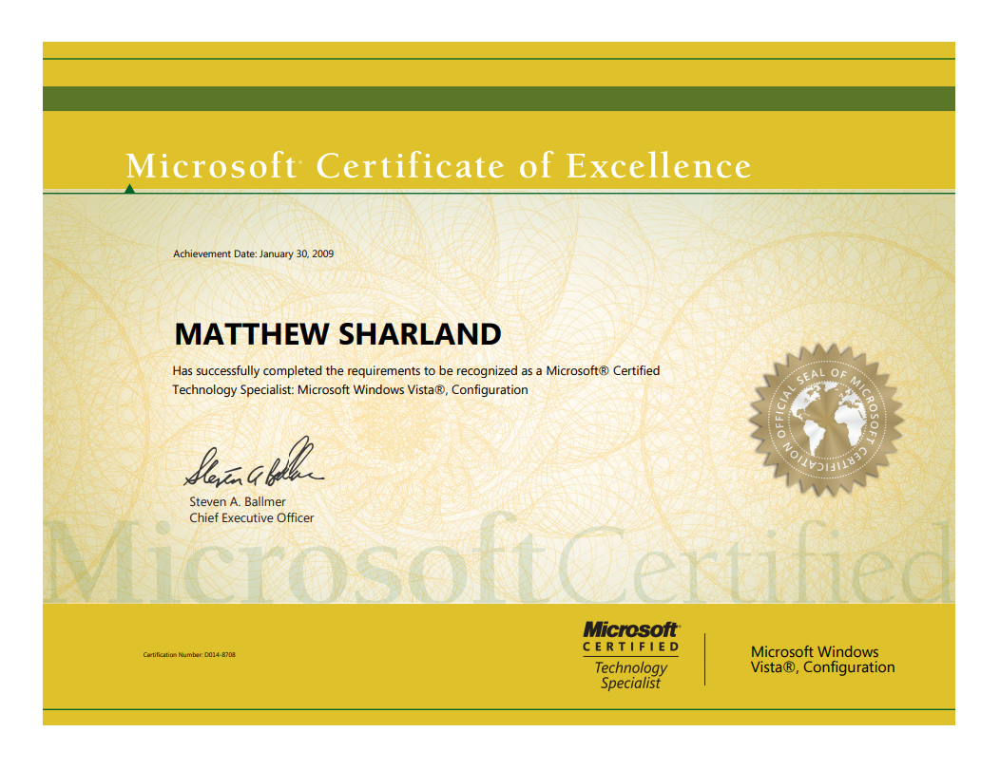
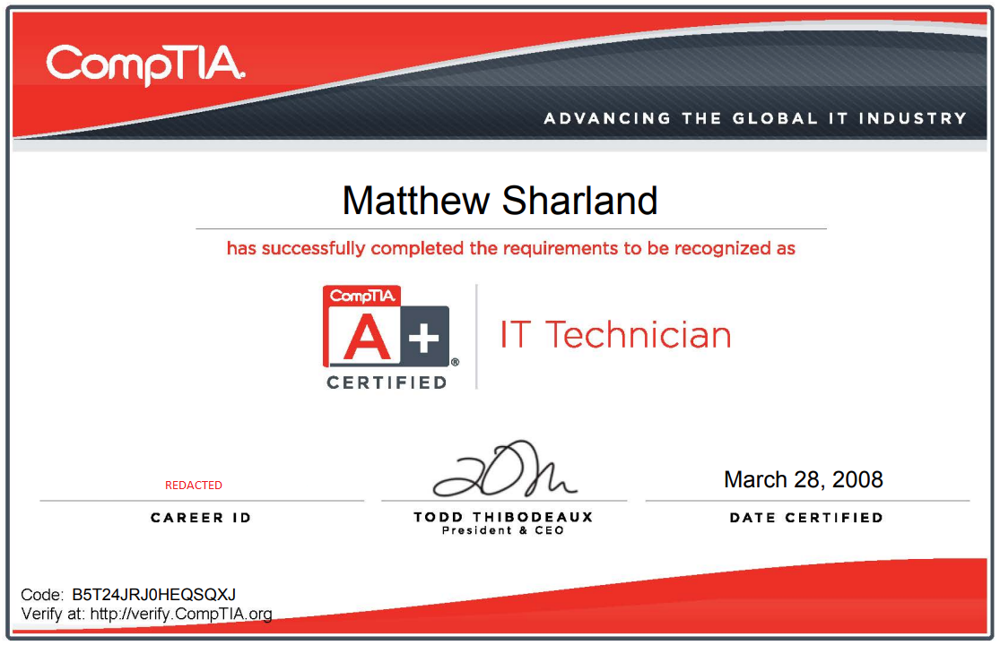

# :book: Portfolio

A collection of achievements, awards, certifications, pictures, testimonials and code samples from the highlights of my career.

## #OpenToWork
---

## Code  
- [Code Samples - Readme](./code/README.md)  
- [Code Samples - Raw Files](./code)  

## Achievements

- [Awards](#awards)
- [Certifications](#certifications)
- [Public Speaking](#public-speaking)
- [Testimonials](#testimonials)

## External Links

- [www.mattsharland.com](https://www.mattsharland.com/)  
- [LinkedIn Profile](https://www.linkedin.com/in/msharland/)  

---

## Awards

### Dale Carnegie Breakthrough Award  
  

---

### Rookie of the Year  
  

---

### Rock Honors Award  
  

---

### Rock Honors Award  
  

---

### MVP  
  

---

### Rock Honors Nomination  
  

[Back to Top](#achievements)

---

## Certifications

- [2019, SAFe 4 DevOps Practicioner](#2019-safe-4-devops-practicioner)  
- [2014, Imprivata](#2014-imprivata)  
- [2010, CompTIA Network +](#2010-comptia-network)
- [2009, MCSA 2003](#2009-mcsa-2003) 
- [2009, MCSE 2003](#2009-mcse-2003)  
- [2009, MCTS Vista](#2009-mcts-vista)  
- [2009, MCTS Vista, Configuration](#2009-mcts-vista-configuration)
- [2008, CompTIA A+](#2008-comptia-a)  
- [2008, MCP XP](#2008-mcp-xp)  

---

### 2019, SAFe 4 DevOps Practicioner

---

### 2014, Imprivata

---

### 2014, MCSA 2012

---

### 2013, MCSE, Private Cloud

---

### 2012, AppSense, no relation

---

### 2010, CompTIA Network+

---

### 2009, MCSE 2003

---

### 2009, MCSA 2003

---

### 2009, MCTS Vista, Configuration

---

### 2009, MCTS Vista

---

### 2008, CompTIA A+
  

---

### 2008, MCP XP

[Back to Top](#achievements)

---

## Public Speaking

In 2019, Rocket Companies gave the opporuntiy for the previous year's winners to present an award at the Rock Honors hosted at the Fillmore Detroit in front of 2,000 people.  

I presented for Best Achievement in a Technology Support Role.  

### And the award goes to...

### The Fillmore Detroit

[Back to Top](#achievements)

---

## Testimonials

*"Thank you for being dedicated to our team! Your willingness to always lend a helping hand is amazing! The application you are building is going to do wonders to shed light in areas we don't currently have any! I can't wait to see what else you have in store for us!! Thank you for all you do for our team!!!!"*  
-Senior Systems Engineer

---

*"You did an awesome job with the PowerShell script for the compliance request. It will simplify the audit process and provide meaningful data that we can use to make improvements. Great work!"*  
-Matt's Team Leader  

---

"I wanted to prop you out as I think you did a fantastic job at gathering information on the production issue. I want to make sure that you are recognized for digging in with your expertise to help us gather more information on this issue."*  
-DevOps Engineer  

---

*"Matt, thank you for always being a rockstar and tackling our issues immediately!"*  
-Database Engineer  

---

*"Matt, thanks for creating a handy dashboard in Dynatrace for the critical services. This WILL make my life so much easier when looking for failures for our critical systems like a one stop shop. I appreciate Dynatrace and you my friend, so THANKS a lot!"*  
-Software Architect  

---

*"Your sense of urgency is awesome! Great job helping the team come up with a quick solution for their quality assurance process. Because of your hard work they can start on Monday as planned!"*    
-Project Manager  

---

*"Thanks a lot for helping us with all our requests and help with finding a solution for SQL server monitoring!"*  
-Director of Database Administration

---

*"Thank you Matt for looking into the PowerBI load-balancing issue (in Test). I really appreciate your quick response. You rock."*  
-Senior Software Engineer

---

*"Thank you Matt for being on this crazy ride with me. You have been key in helping with getting new monitoring setup. Without these monitors we wouldn't have the visibility that allowed us to be able to predict where new jobs should be placed. Thank you for working through the weekend and getting it ready for the war room on Monday. Your dedication means a more stable environment!"*  
-Senior Systems Engineer

---

*"Thank you for responding with a sense of urgency and working to scale out our midware servers. Your help was instrumental in our success today. Our message pipeline will now be ready to handle increased volume and we will have more visibility than ever."*  
-Matt's Direct Team Leader

---

*"Matt has been a rockstar when it came to the production web server cutover. Without his knowledge and dedication we would have never made this cutover happen! He was key in diagnosing issues as they arose during the cutover during our maintenance time frame! With his monitoring and persistence we cutover 2 of our major sites along with our new session state server!"*    
-Senior System Engineer

---

*"Thanks for your help pulling numbers on our server performance on such short notice. You're always willing to jump in and help figure out any issues we have, and suggesting ways to make things better!"*  
-Software Engineer

---

*"Thank you Matt for your quick and effective response to resolve the issue with the vendor DLL in the Beta environment by ensuring the correct DLL was put into place! Your efforts allow our company to call them in Beta and have confidence that the data is correct and reliable!  You are very consistent in your high level of service and always a pleasure to work with!!!  Thank you so much."*  
-Team Leader of a Software Engineering Team that Matt supported

---

*"I don't think I've ever gone to Matt with a problem and walked away with anything other than a solution. Thank you for being so reliable and such a pleasant person to work with!*"  
-Software Engineer

---

*"Matt was instrumental in helping our team resolve a production error in a timely manner. Matt is always available to take on opportunities to really impact all of IT and the company as a whole. We are very lucky and proud to have you, Matt! Keep setting the example!"*  
-Software Engineer

---

*"It's a pleasure working with you. You always go above and beyond to help with any server issues. You kept me posted and made sure things got resolved. You Rock!"*  
-Software Engineer

---

*"Thank you for the FANTASTIC service fixing our service accounts."*  
-Directory of Technology  

---

*"Matt...I really can't put to words how much of a help you were! You always were quick to help with all the little issues we were seeing in the lower environments. You helped make sure our ducks were in a row for go-live as much as you could. Despite a difficult prod push in general, your efforts on go-live night were rockstar and made it so we were able to move ahead with this project on time! Thank you so much!!!"*  
-Software Engineer  

---

*"Thank you Matt for meeting with me to talk about our infrastructure architecture - with a good example. 
I really appreciated you taking the time to meet with me and walk thru the design and how we setup the environments. 
I'm sure I will be scheduling a follow up for us in the future!" Thanks again!"*  
-Solution Architect

---

*"I just can't speak enough about the ways Matt Sharland continues to raise our level of awareness. He keeps coming up with these automated reports that are so insightful. I thank you Matt for the time that you put into these. With each of these reports we are slowly changing mindsets."*  
-Matt's Director

---

*"Thank you for tirelessly working throughout the night to migrate us off of the old storage appliance. All of the troubleshooting and work you did was exceptional and appreciated greatly. The problems we faced were not trivial and everyone pitched in to help, figured all of them out, and completed a project that was years in the making. Could not have done it without you."*  
-Storage Engineer  

---

*"Last Friday night and Saturday morning, we were attempting to do a storage migration overnight. Matt was not expecting to be on that call but when we got stuck, we desperately reached out for help and he responded within minutes. There was no attitude of "But it's Friday night!" or "It's not my shift or my problem". He just got to work and played an instrumental part in making it successful despite challenges along the way. Matt was able to wake up from a deep sleep and come up with the solution to why we were stuck for the past several months. Thanks for jumping on that call with us at the last minute and for your contributions to overcome the obstacles we faced. It's great to have you on our team when needed!"*  
-Vice President of Technology

---

*"Matt Sharland, you are an awareness king!!  I can’t thank you enough."*  
-Matt's Director

---

*"This is great.  As always, thank you for the awareness.  I am going to see what I can do to start socializing what this means to our company and getting a commitment to address this. Again, I can’t tell you how great it is to finally have this visibility.  I have been asking others for over a year for this information and they haven’t been able to deliver. This is amazing Matt.  It will take me a bit to digest this. This is so great. Thanks Matt."*  
-Director of Information Security  

---

[Back to Top](#achievements)
